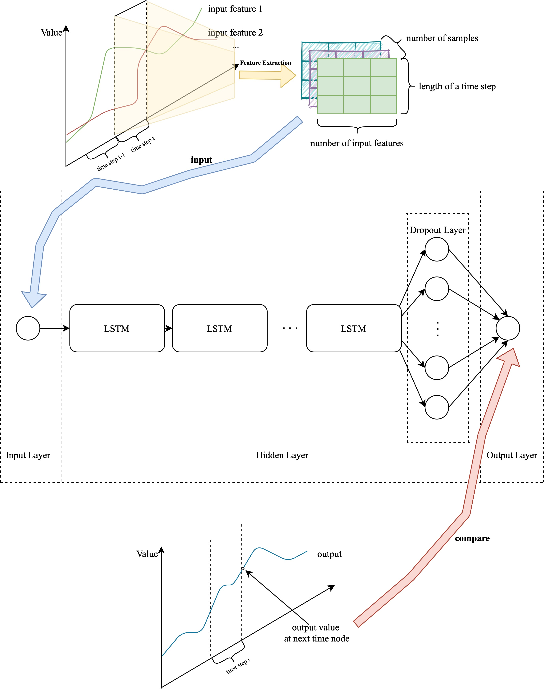

 English | [简体中文](./README.zh-CN.md)

   

# Introduction
Bagpipe is an offline timing series data mining platform based on pure front end. After loading, the whole process runs completely locally, without interaction with a third party. Data need not be transmitted through the network for analysis, which greatly ensures the security of users' privacy data.

# Functionalities
- data prepocessing
    - time series column detect
    - missing data filling
    - correlation analysis
    - features choose
    - anomaly data remove

- data visualization
    - line diagram
    - bar diagram
    - parallel coordinate diagram
    - 2D-histogram diagram
    - sunburst diagram

- deep learning model training
    - customized hyperparamters
    - mutiple times training
    - model download

# Detail
- Flow chart
  


- Deep learning network structure


# Browser Support
These browsers have been tested: 
| [](http://godban.github.io/browsers-support-badges/)</br>Firefox | [](http://godban.github.io/browsers-support-badges/)</br>Chrome | [](http://godban.github.io/browsers-support-badges/)</br>Safari | 
|:---:|:---:|:---:|
| last 2 versions | last 2 versions | last 2 versions |

# How to run?
```
yarn
yarn start
```

# Demo
https://giorgiopeng.github.io/FYP/

# About the Name
The name of the platform is from a character, Bagpipe, in the mobile game 「Arknights」.  
  
Because the girl creates a new start game mode.  
Hope the platform can create new style of machine learning.
