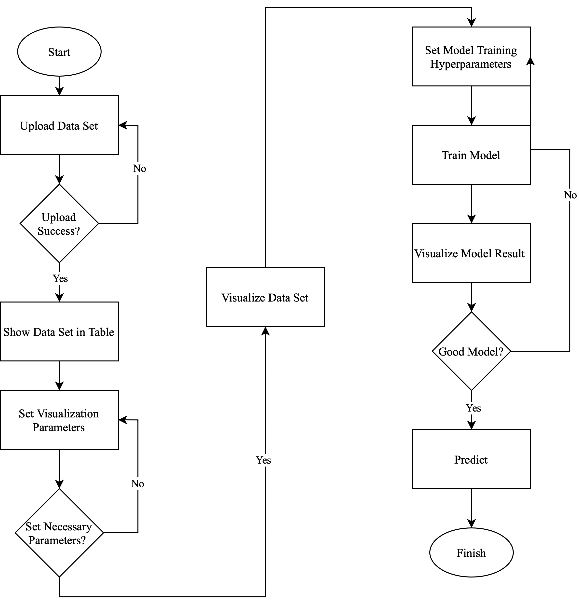
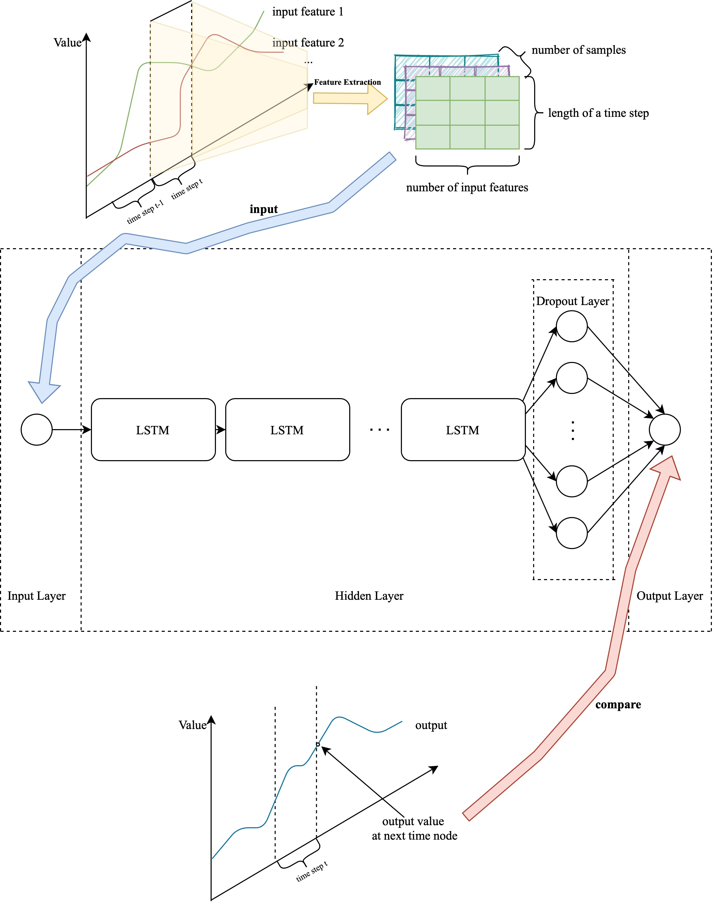

 [English](./README.md) | 简体中文

   

# 简介
Bagpipe是一个基于纯前端的离线时序数据挖掘平台，加载完成后整个过程完全在本地运行，无需与第三方交互，需要分析的数据不需要通过网络进行传输，极大的确保了用户隐私数据的安全性。

# 功能
- 数据预处理
    - 时序字段侦测
    - 数据填充
    - 相关性分析
    - 待分析字段选取
    - 异常数据剔除

- 数据可视化
    - 折线图
    - 柱状图
    - 平行多线图
    - 2D直方图
    - 日图

- 模型训练
    - 超参数自定义
    - 多次训练
    - 模型下载

# 详细介绍
- 操作流程图
  


- 深度学习模型结构
  

# 浏览器支持
已经测试过的浏览器：  
| [](http://godban.github.io/browsers-support-badges/)</br>Firefox | [](http://godban.github.io/browsers-support-badges/)</br>Chrome | [](http://godban.github.io/browsers-support-badges/)</br>Safari | 
|:---:|:---:|:---:|
| last 2 versions | last 2 versions | last 2 versions |


# 怎么运行
```
yarn
yarn start
```

# 地址
https://giorgiopeng.github.io/FYP/

# 名称来源
该平台名称取自手游「明日方舟」干员「风笛」 
   
希望该平台能像她开创新的游戏开局体系一样  
**创建出新的机器学习方式打开方式**